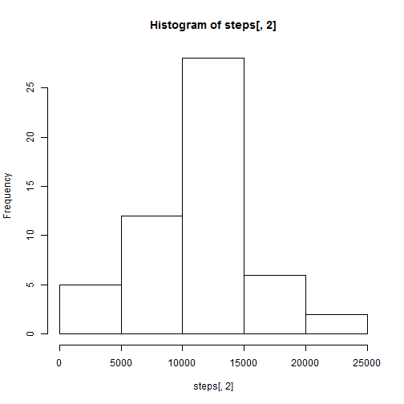
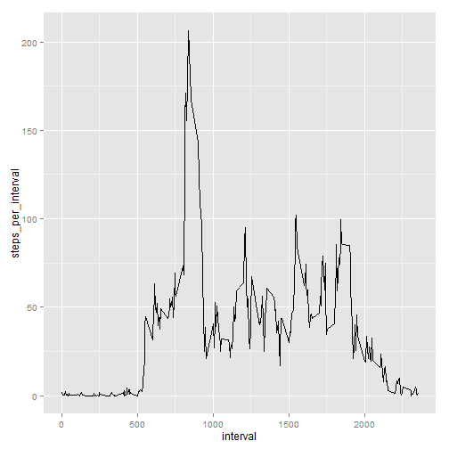
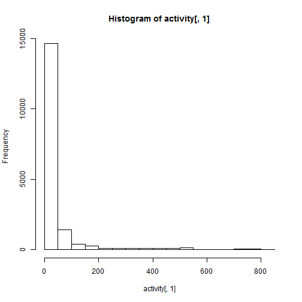
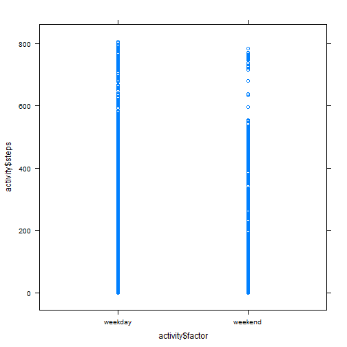

Title
========================================================

This is an R Markdown document containing Reproducible Research Peer Assessment 1 for greenisagoodcolor's data science coursera track. 

First let's read in the data and then check to see that it loaded properly

```r
setwd("~/reproducible_research/RepData_PeerAssessment1")
activity <- read.csv("activity.csv", header=TRUE)
head(activity)
```

```
##   steps       date interval
## 1    NA 2012-10-01        0
## 2    NA 2012-10-01        5
## 3    NA 2012-10-01       10
## 4    NA 2012-10-01       15
## 5    NA 2012-10-01       20
## 6    NA 2012-10-01       25
```

```r
str(activity)
```

```
## 'data.frame':	17568 obs. of  3 variables:
##  $ steps   : int  NA NA NA NA NA NA NA NA NA NA ...
##  $ date    : Factor w/ 61 levels "2012-10-01","2012-10-02",..: 1 1 1 1 1 1 1 1 1 1 ...
##  $ interval: int  0 5 10 15 20 25 30 35 40 45 ...
```

Uh oh, it looks like the date's are factors and not POSIX. Let's use lubridate to smooth that out.


```r
library(lubridate)
```

```
## Warning: package 'lubridate' was built under R version 3.0.3
```

```r
activity[, 2] <- ymd(activity[, 2])
str(activity)
```

```
## 'data.frame':	17568 obs. of  3 variables:
##  $ steps   : int  NA NA NA NA NA NA NA NA NA NA ...
##  $ date    : POSIXct, format: "2012-10-01" "2012-10-01" ...
##  $ interval: int  0 5 10 15 20 25 30 35 40 45 ...
```

Alright, cool. The dates are now able to be interpreted by R as time.

Now let's try question 1:

## What is mean total number of steps taken per day?

"For this part of the assignment, you can ignore the missing values in the dataset


```r
no.na <- na.omit(activity)
```

* Make a histogram of the total number of steps taken each day

```r
##sum number of steps for each day using ddply
library(plyr)
```

```
## Warning: package 'plyr' was built under R version 3.0.3
```

```
## 
## Attaching package: 'plyr'
## 
## The following object is masked from 'package:lubridate':
## 
##     here
```

```r
steps <- ddply(no.na, .(date), summarise, total_steps=sum(steps))

## make a histogram
hist(steps[, 2])
```

 

* Calculate and report the mean and median total number of steps taken per day

```r
mean(steps[, 2])
```

```
## [1] 10766
```

```r
median(steps[, 2])
```

```
## [1] 10765
```

Next, let's try the second question: 

##What is the average daily activity pattern?

"Make a time series plot (i.e. type = "l") of the 5-minute interval (x-axis) and the average number of steps taken, averaged across all days (y-axis)"


```r
library(ggplot2)
```

```
## Warning: package 'ggplot2' was built under R version 3.0.3
```

```r
avg_interval <- ddply(no.na, .(interval), summarise, steps_per_interval=mean(steps))
ggplot(avg_interval, aes(x=interval, y=steps_per_interval)) + geom_line()
```

 

"Which 5-minute interval, on average across all the days in the dataset, contains the maximum number of steps?"


```r
avg_interval[which.max(avg_interval$steps_per_interval),1]
```

```
## [1] 835
```

Makes sense if you walk to work in the morning. What question is next?

##Imputing missing values

Note that there are a number of days/intervals where there are missing values (coded as NA). The presence of missing days may introduce bias into some calculations or summaries of the data.

* Calculate and report the total number of missing values in the dataset (i.e. the total number of rows with NAs)


```r
sum(is.na(activity))
```

```
## [1] 2304
```

* Devise a strategy for filling in all of the missing values in the dataset. The strategy does not need to be sophisticated. For example, you could use the mean/median for that day, or the mean for that 5-minute interval, etc.

* Create a new dataset that is equal to the original dataset but with the missing data filled in.

I am going to do this by writing a for loop to go through the original data frame and substitute the average steps for that interval if it contains an NA or 0.


```r
x <- NULL
for (i in 1:nrow(activity)) {
        if (is.na(activity[i, 1])) {
                x <- activity[i, 3]
                activity[i, 1] <- avg_interval[match(x, avg_interval$interval), 2]
                } 
}
```

Make a histogram of the total number of steps taken each day and Calculate and report the mean and median total number of steps taken per day. Do these values differ from the estimates from the first part of the assignment? What is the impact of imputing missing data on the estimates of the total daily number of steps?


```r
hist(activity[, 1])
```

 

```r
mean(activity[, 1])
```

```
## [1] 37.38
```

```r
median(activity[, 1])
```

```
## [1] 0
```

## Are there differences in activity patterns between weekdays and weekends?

* Create a new factor variable in the dataset with two levels - "weekday" and "weekend" indicating whether a given date is a weekday or weekend day.


```r
activity$day <- weekdays(activity$date)
for (i in 1:nrow(activity)) {
        if (activity[i, 4]=="Saturday") {
                        activity[i, 4] <- "weekend"
                } else if (activity[i, 4]=="Sunday") {
                        activity[i, 4] <- "weekend"
                } else {activity[i, 4] <- "weekday"}
}
activity$factor <- factor(activity$day)

library(lattice)
```

```
## Warning: package 'lattice' was built under R version 3.0.3
```

```r
xyplot(activity$steps ~ activity$factor)
```

 


